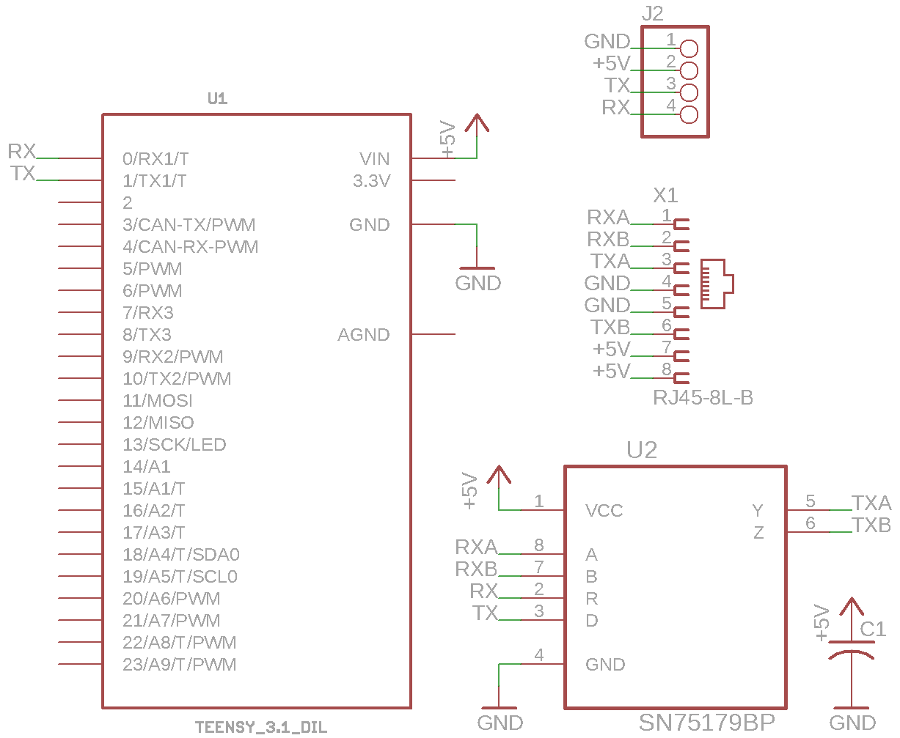

# Mesa SmartSerial (SSLBP) device template project

This is an Arduino IDE sketch that implements a simple (dummy)
Mesa Electronic compatible SmartSerial device accessible from
HostMot2/LinuxCNC. The code is a work in progress, so it's a
bit ugly, but I hope to eventually clean it up when I fully
understand/implement the SSLBP protocol.

While Arduino IDE is being used, it isn't strictly necessary
as most of the code uses standard C and not Arduino-specific
APIs. The code that deals with Serial/Serial1 could easily
be ported to another API. Arduino IDE was only chosen for
convenience.

## Requirements

* Arduino IDE https://www.arduino.cc/en/main/software
* Teensyduino https://www.pjrc.com/teensy/teensyduino.html
* Teensy 3.2 https://www.pjrc.com/store/teensy32.html

## Hardware

This code was developed for a PJRC Teensy 3.2
(NXP/Freescale MX20DX256VLH7 ARM MCU). I used the hardware
accelerated "Serial1" @ 2.5MBaud with a Texas Instruments
SN75179BP RS-422 transceiver chip. A schematic is provided.

https://www.digikey.com/product-detail/en/texas-instruments/SN75179BP/296-6861-5-ND/370233

https://www.digikey.com/product-detail/en/nxp-usa-inc/MK20DX256VLH7/MK20DX256VLH7-ND/3742957
